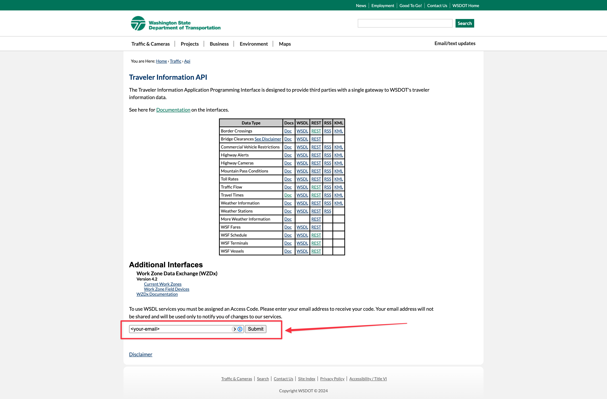

# Data Science Workflows with Posit Tools — Python Focus

## posit::conf(2024)

by Gagandeep Singh, Sam Edwardes

-----

:spiral_calendar: August 12, 2024
:alarm_clock:     09:00 - 17:00
:hotel:           ROOM TBD
:writing_hand:    [pos.it/conf](http://pos.it/conf)

-----

## Description

In this Python-focused workshop, we will discuss ways to improve your data science workflows! During the course, we will review packages for data validation, alerting, modeling, and more. We’ll use Posit’s open source and professional tools to string all the pieces together for an efficient workflow. We’ll discuss environments, managing deployed content, working with databases, and interoperability across data products.

## Audience

This workshop is for you if you...

- Build finished data products starting from raw data and are looking to improve your workflow
- Are looking to expand your knowledge of Posit open source and professional tools
- Want to improve interoperability between data products in your work or on your team
- Have experience developing in Python. An analogous course with an R focus is also offered

## Prework

**Most important prework**

- [ ] Bring your laptop.
- [ ] Sign up for a GitHub account (so that we can use GitHub discussions).
- [ ] Get an access code for the <https://wsdot.wa.gov/traffic/api/> API. Make sure to save your access code!

Expand to see screenshot of how to get the access code.

**Suggested prework**

We are going to cover a LOT of breadth during the workshop. The suggestions below are completely OPTIONAL. If you have time, they will help you get the most out of the workshop.

- [ ] We will primarily use polars (https://pola.rs/) for working with dataframes. You don't need to be an expert, but it would be helpful to have a basic understanding of how to use it. We suggest you install polars and go through the getting started guide: https://docs.pola.rs/user-guide/getting-started/
- [ ] We will work with a tool called uv for creating and managing virtual environments. I suggest reading this blog post (written by Sam) to understand the basics: https://samedwardes.com/blog/2024-04-21-python-uv-workflow/.
- [ ] We will build an interactive web app with Shiny. Work your way through the "Learn Shiny" section of the docs to get a better understanding of how it works: https://shiny.posit.co/py/docs/overview.html. Our app will use the "core" API: https://shiny.posit.co/py/docs/express-vs-core.html.
- [ ] For data validation we will use pandera (https://pandera.readthedocs.io/en/stable/index.html). We will use the "DataFrame Models" approach: https://pandera.readthedocs.io/en/stable/dataframe_models.html
- [ ] For training our model we will use scikit-learn (https://scikit-learn.org/stable/)
- [ ] For model deployment and monitoring we will use vetiver (https://vetiver.posit.co/).

## Schedule

| Time          | Activity         |
| :------------ | :--------------- |
| 09:00 - 10:30 | Session 1        |
| 10:30 - 11:00 | *Coffee break*   |
| 11:00 - 12:30 | Session 2        |
| 12:30 - 13:30 | *Lunch break*    |
| 13:30 - 15:00 | Session 3        |
| 15:00 - 15:30 | *Coffee break*   |
| 15:30 - 17:00 | Session 4        |

## Instructors

**Gagandeep Singh**

Gagandeep is a Solutions Engineer at Posit PBS based in Toronto, Canada. He is a former software engineer and data scientist who has worked in a variety of cross-technology teams before joining Posit.

- https://github.com/gsingh91

**Sam Edwardes**

Sam is a Solutions Engineer at Posit PBC based out of Vancouver, British Columbia, Canada. As a Solutions Engineer he helps customers effectively use Posit's professional products with open source Python and R tools. He is passionate about Python, R, and all things open source!

- https://github.com/SamEdwardes
- https://fosstodon.org/@SamEdwardes
- https://www.linkedin.com/in/samedwardes/

-----

 This work is
licensed under a [Creative Commons Attribution 4.0 International
License](https://creativecommons.org/licenses/by/4.0/).
