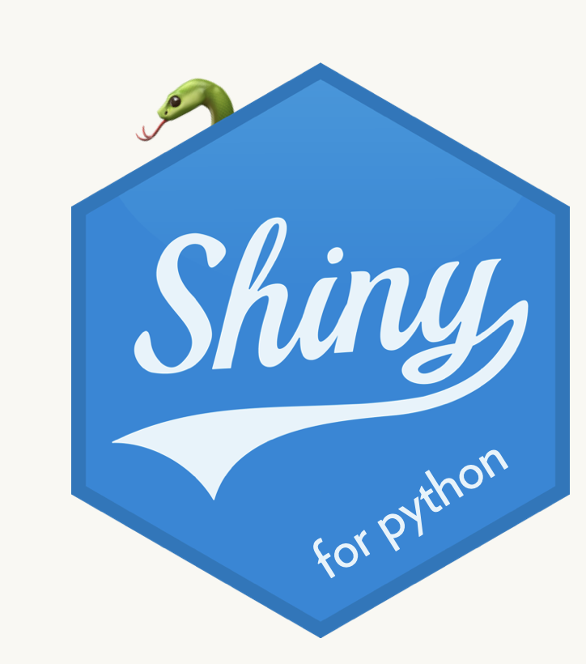

# Shiny App

## Task 1 - What is Shiny for Python?

Shiny for Python is a framework for building web apps in pure Python.

> Effortless Python web applications with the power of reactive programming.

- https://shiny.rstudio.com/py
- Powerful and intuitive reactivity model
- Highly customizable
- Designed to work integrate with popular visualization packages like Matplotlib, Seaborn, Plotnine, and Plotly. You can even embed live Jupyter widgets in your Shiny apps.



**Pure Python**

- Shiny
- Dash
- Streamlit
- Bokeh

If you are interested, here are some articles and videos that compare these popular frameworks:

- <https://www.youtube.com/watch?v=LDd2ao5KjKM>
- <https://plotly.com/comparing-dash-shiny-streamlit/>

**HTML Templates**

- Flask
- FastAPI
- Django
- Litestar

### 🔄 Task 1 - Understand Shiny Essentials

Lets walk through the first page of the docs: <https://shiny.posit.co/py/docs/overview.html>. To get started with Shiny you need to understand the two main components:

- UI
- Server

### 🔄 Task 2 - Shiny "Express" vs. "Core"

In the docs you will see there are two ways to use Shiny: "Express" and "Core": <https://shiny.posit.co/py/docs/express-vs-core.html>. In this workshop we will focus on "Core".

### 🔄 Task 3 - Run the Shiny App

As always, start by creating a virtual environment and install the dependencies:

```bash
uv venv
source .venv/bin/activate
uv pip compile requirements.in --quiet --output-file requirements.txt
uv pip sync requirements.txt
```

To run the Shiny app, use the following command:

```bash
shiny run app.py
```

You can preview the app using the Posit Workbench extension in VS Code (<https://docs.posit.co/ide/server-pro/user/vs-code/guide/proxying-web-servers.html>.)

Alternatively, you can use the Shiny for Python VS Code extension to preview the app inside VS Code (<https://marketplace.visualstudio.com/items?itemName=Posit.shiny>).

### 🔄 Task 4 - Understand the Code

This is a relatively complex app. Lets walk through some the design principles and most important components of the app.

- Leverage databases for compute.
- Do as little compute as possible!
- Use modules for code organization (<https://shiny.posit.co/py/docs/modules.html>).
- Understanding session context vs. global context (<https://shiny.posit.co/py/docs/sessions.html>).

### 🔄 Task 5 - Deploy to Connect

```bash
rsconnect deploy shiny --title "Seattle Ferries - Delay Prediction App" --exclude ".cache" --exclude ".ruff_cache" --exclude ".posit" .
```

### 🔄 Task 6 - Connect runtime settings

Visit your deployed app and click on the settings icon.

- Settings explained: <https://docs.posit.co/connect/user/content-settings/#content-runtime>
- Understanding processes vs. connections and app performance:
  - Non blocking operations: <https://shiny.posit.co/py/docs/nonblocking.html>
  - The restaurant analogy: <https://fastapi.tiangolo.com/async/>

### 🔄 Task 7 - Git backed deployment

```bash
rsconnect write-manifest shiny --exclude ".cache" --exclude ".ruff_cache" --exclude ".posit" --exclude "**/*.pyc" --exclude ".env" --overwrite .
```
